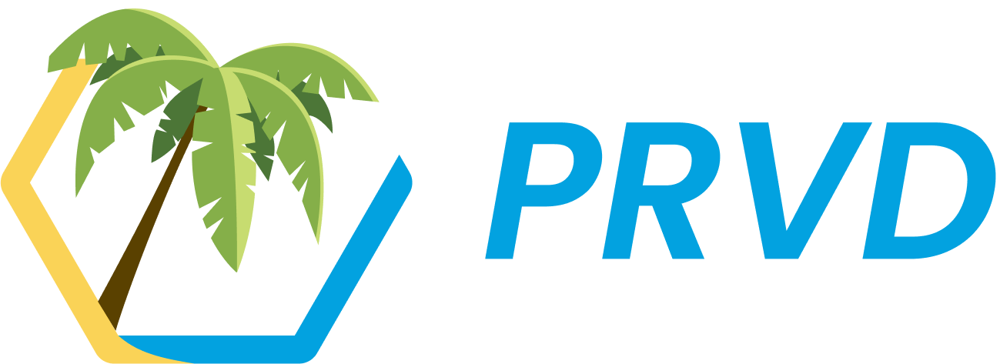

**The Open Project closed on 14 July 2023. The open source assets remain publicly accessible at https://github.com/prvd-project. OASIS appreciates the efforts of all those who participated in this work.**

-------

# PRVD

PRVD is an [OASIS Open Project](https://oasis-open-projects.org/). PRVD advances a leading production-grade reference implementation of the [Baseline Protocol](http://baseline-protocol.org/), an open standard that helps synchronize multiparty workflows across a variety of sectors and permeate decentralized finance throughout global commerce.

<!---
For more information on PRVD, see the project's website.
-->

For more information on the goals of this effort, see the [project charter](https://github.com/prvd-oasis/oasis-open-project/blob/main/CHARTER.md). 

General questions about OASIS Open Projects may be directed to OASIS staff at [project-admin@lists.oasis-open-projects.org](project-admin@lists.oasis-open-projects.org).

# Other assets

In addition to this GitHub organization, this project also makes use of other assets. 

<!---
- The [Open Project name] website is at [url to website]. The website contains news, announcements, and other information of interest about the project. 
-->

- [General purpose mailing list](https://lists.oasis-open-projects.org/g/prvd-oasis). To subscribe, send an empty email message to prvd-oasis+subscribe@lists.oasis-open-projects.org. Anyone interested is welcome to subscribe and send email to the list. The list maintains an [archive](https://lists.oasis-open-projects.org/g/prvd-oasis/topics).

- [Project Governing Board mailing list](https://lists.oasis-open-projects.org/g/prvd-oasis-pgb). This is the discussion list for use by the members of the PGB. To subscribe, send an empty email message to [prvd-oasis-pgb+subscribe@lists.oasis-open-projects.org](prvd-oasis-pgb+subscribe@lists.oasis-open-projects.org). Anyone interested is welcome to subscribe read-only. The list maintains an [archive](https://lists.oasis-open-projects.org/g/prvd-oasis-pgb/topics).

<!-- [Technical Steering Committee mailing list](url for list archive). This is the discussion list for use by the members of the TSC. To subscribe, send an empty email message to [subscription email]. Anyone interested is welcome to subscribe read-only. The list maintains an [archive](url to archive). -->

- Join the [PRVD Open Project Slack channel](https://join.slack.com/t/prvd-oasis/shared_invite/zt-19jub2efm-9tymO0VjwTjpLafDMawuxw).

# Contributing

Please read [CONTRIBUTING.md](CONTRIBUTING.md) for details how to join the project, contribute changes to our repositories and communicate with the rest of the project contributors. Please become familiar with and follow the [code of conduct](CODE-OF-CONDUCT.md).

# Governance

PRVD operates under the terms of the [Open Project Rules](https://www.oasis-open.org/policies-guidelines/open-projects-process) and the applicable license(s) specified in [LICENSE.md](LICENSE.md). Further details can be found in [GOVERNANCE.md](GOVERNANCE.md).

# CLA & Non-assert signatures required

All technical contributions must be covered by a Contributor's License Agreement. This requirement allows our work to advance through OASIS standards development stages and potentially be submitted to de jure organizations such as ISO. You will get a prompt to sign this document when you submit your first pull request to a project repository, or you can sign [here](https://cla-assistant.io/prvd-oasis/oasis-open-project). If you are contributing on behalf of your employer, you must also sign the ECLA [here](https://www.oasis-open.org/open-projects/cla/entity-cla-20210630/).
